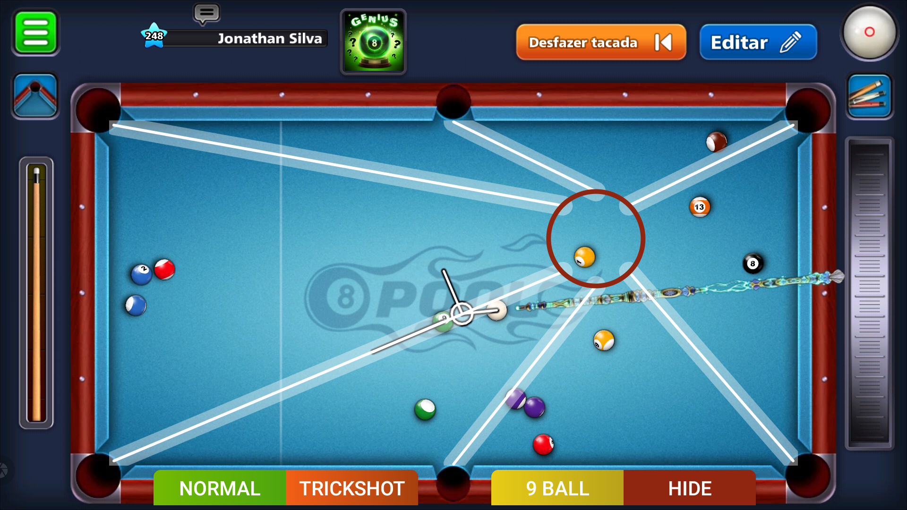
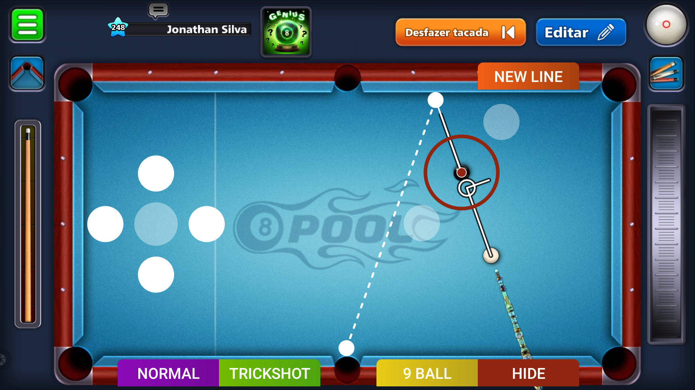
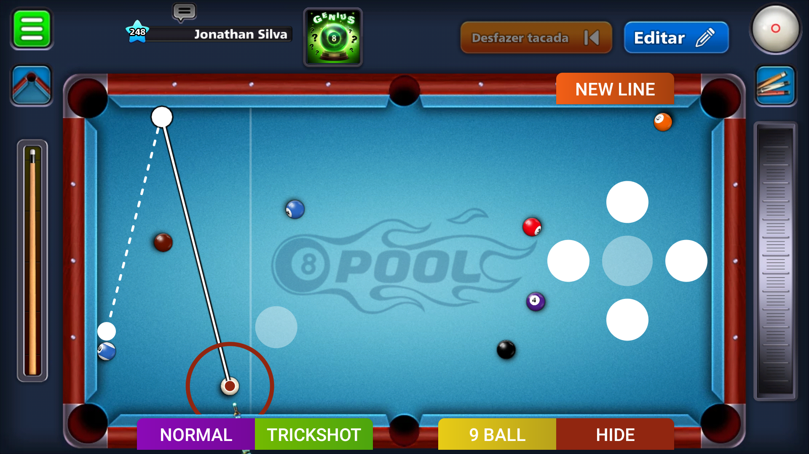
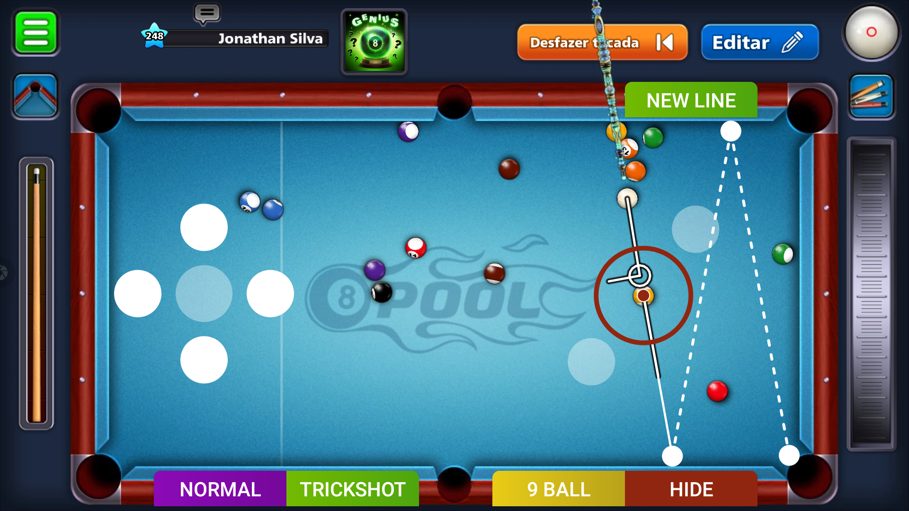
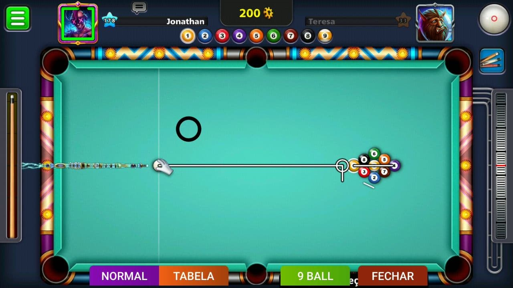
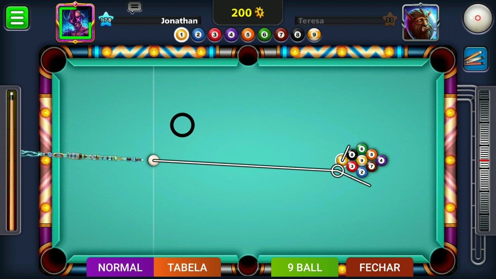
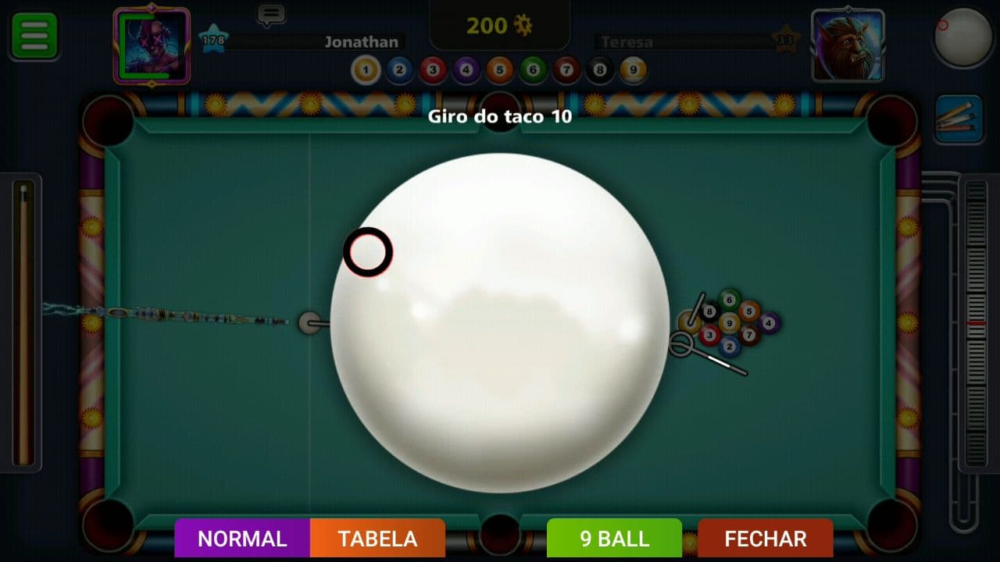
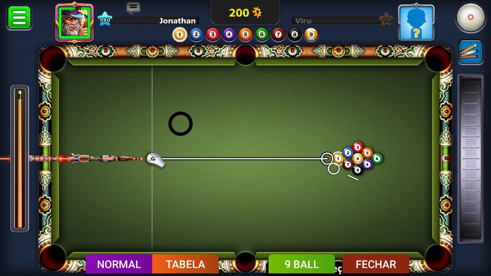
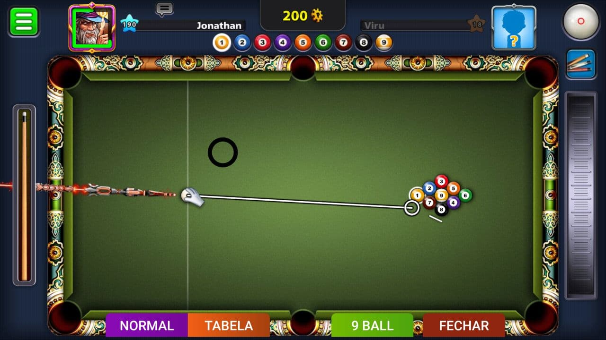
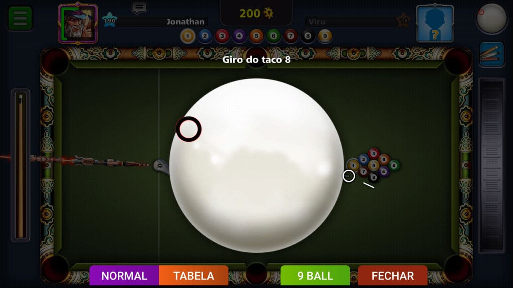

**Importante**

Use o Android Studio para importar o projeto e gerar o .apk

É preciso que você faça alterações no arquivo *[dimens.xml](https://github.com/jonathansilva/8BallPool/blob/main/app/src/main/res/values/dimens.xml)* para ajustar o layout à mesa do jogo

- Não utilize o mesmo *nome de pacote* ( app.hack.eightballpool )
- Não publique na Play Store

> O hack é exibido na tela sempre que balançar/agitar o celular

**Important**

Use Android Studio to import the project and generate the .apk

You need to make changes to the *[dimens.xml](https://github.com/jonathansilva/8BallPool/blob/main/app/src/main/res/values/dimens.xml)* file to fit the layout to the game table

- Do not use the same *package name* ( app.hack.eightballpool )
- Do not post on the Play Store

> The hack is displayed on the screen whenever you shake the phone

## Normal

## Trickshot

## 9 Ball

Este modo não é mais recomendado e será removido em futuras atualizações. O jogo troca a posição X das bolas ao iniciar a mesa

This mode is no longer recommended and will be removed in future updates. The game changes the X position of the balls when starting the table

> Apenas um guia / Just a guide

> 9 Ball No Guideline

